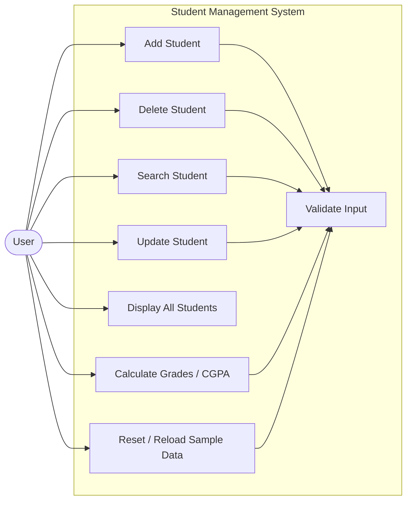
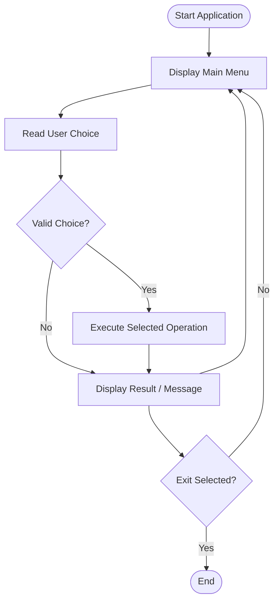
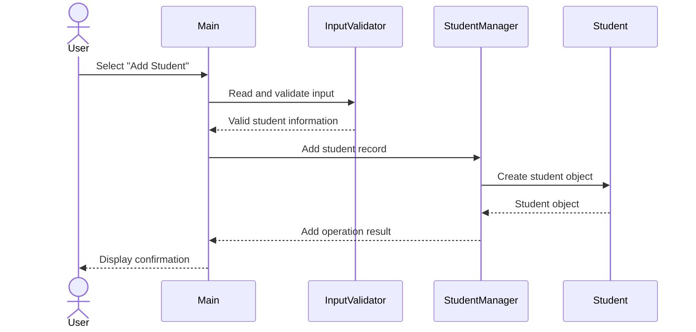
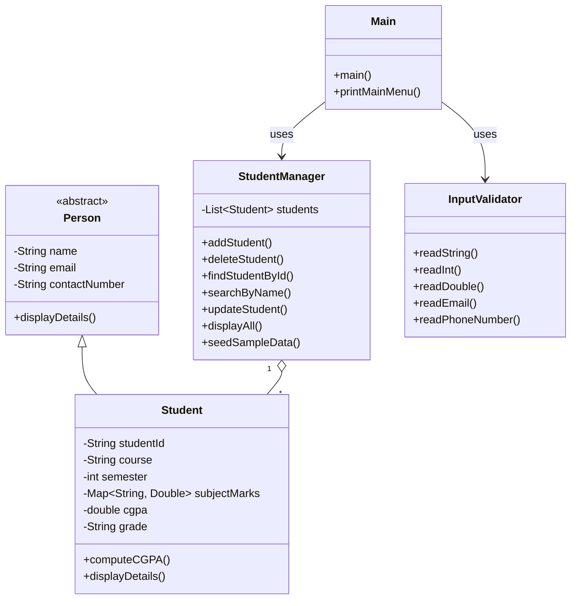

# PROJECT REPORT
## Student Management System (Java CLI)

> **Submission note:** Replace the bracketed cover-page fields with your own course/submission information before exporting this report to PDF. No personal names, registration numbers, phone numbers, emails, or local computer paths are included in this report.

---

# Cover Page

**Project Title:** Student Management System  
**Technology:** Java  
**Project Type:** Command-Line Application  
**Course / Subject:** [Course Name]  
**Student Name:** [Student Name]  
**Registration Number:** [Registration Number]  
**Faculty / School:** [Faculty / School Name]  
**Academic Year:** [Academic Year]

---

# 1. Introduction

The **Student Management System** is a command-line Java application developed to demonstrate practical Object-Oriented Programming and core Java concepts. The system provides a structured way to maintain student records, update student information, manage subject marks, search for student records, and calculate academic performance.

The application is designed as a standalone program using standard Java and in-memory collections. Its implementation is divided into model, service, utility, and driver components so that different responsibilities remain separated.

---

# 2. Problem Statement

Managing student information and academic performance manually can make it difficult to maintain records consistently, update information, search for specific students, and calculate academic results without errors.

A simple console-based application can provide a structured approach to these activities by allowing users to create, modify, search, display, and delete student records while applying validation to user input and automatically calculating academic results.

---

# 3. Objectives

The main objectives of the project are:

1. To develop a menu-driven student management application using Java.
2. To apply Object-Oriented Programming principles in a practical project.
3. To provide CRUD-style operations for student records.
4. To manage subject marks and calculate percentage, CGPA, and letter grade.
5. To validate command-line input and handle common invalid-input situations.
6. To organize the implementation into modular Java packages and classes.
7. To demonstrate the use of Java Collections such as `ArrayList` and `LinkedHashMap`.

---

# 4. Scope of the Project

The project covers student record management within a command-line environment.

## Included in Scope

- Adding student records
- Deleting student records
- Searching by Student ID
- Searching by student name
- Updating student information
- Adding and updating subject marks
- Displaying student records
- Calculating percentage and CGPA
- Assigning letter grades
- Loading and resetting sample data
- Validating command-line input

## Outside the Current Scope

- Persistent database storage
- User authentication and authorization
- Web or mobile interface
- Cloud deployment
- Multi-user concurrent access

The current implementation stores information in memory using Java collections.

---

# 5. Functional Requirements

The system is divided into the following major functional modules.

## 5.1 Student Record Management

The system shall allow the user to:

- Add a new student.
- Delete an existing student.
- Display all student records.
- Maintain student identifiers and personal details.

## 5.2 Student Search & Update

The system shall allow the user to:

- Search for a student by Student ID.
- Search for a student by name.
- Update personal information.
- Update course and semester information.
- Add or revise subject marks.

## 5.3 Academic Evaluation

The system shall:

- Store subject-wise marks.
- Calculate the average percentage.
- Calculate the project-defined 10-point CGPA.
- Determine a letter grade from the implemented percentage ranges.
- Display academic results.

## 5.4 Input Validation & Sample Data Management

The system shall:

- Validate numeric inputs.
- Validate marks within the accepted range.
- Validate relevant text, email, and phone-number input.
- Prevent duplicate Student IDs where required by the application.
- Load sample records for testing.
- Reset the sample dataset when requested.

---

# 6. Non-Functional Requirements

The project applies the following non-functional requirements.

## 6.1 Usability

- The application uses a menu-driven command-line interface.
- Prompts are presented clearly for common operations.
- Validation messages guide the user when invalid input is entered.
- Related functions are grouped under understandable menu options.

## 6.2 Reliability

- Invalid numeric input is handled through the input-validation layer.
- Student IDs are checked when records are added.
- Marks are restricted to the accepted range.
- The program is designed to continue normal interaction after recoverable input errors.

## 6.3 Maintainability

- Responsibilities are separated into `model`, `service`, and `util` packages.
- `Main` handles application flow rather than containing all business logic.
- Student data and academic logic are maintained by the `Student` model.
- Record-management logic is maintained by `StudentManager`.
- Input validation is centralized in `InputValidator`.

## 6.4 Resource Efficiency

- Student records are stored using in-memory Java collections.
- The application has no database server or external runtime dependency.
- The project uses standard Java APIs and a simple command-line interface.

---

# 7. Technologies & Tools

| Technology / Tool | Purpose |
|---|---|
| Java | Primary programming language |
| JDK / `javac` | Compilation and execution |
| Java OOP | Abstraction, Encapsulation, Inheritance, Polymorphism |
| `ArrayList` | Dynamic student-record storage |
| `LinkedHashMap` | Subject and mark storage with insertion-order preservation |
| IntelliJ IDEA / VS Code | Development environment |
| Git / GitHub | Version control and source-code hosting |

---

# 8. System Architecture

The application follows a simple layered organization:

```text
+--------------------------+
|          Main            |
|   CLI / Driver Layer     |
+------------+-------------+
             |
             v
+--------------------------+
|     StudentManager       |
|     Service Layer        |
| CRUD / Search / Updates  |
+------------+-------------+
             |
             v
+--------------------------+
|     model.Student        |
|   Student Data + Grades  |
+------------+-------------+
             |
             v
+--------------------------+
|      model.Person        |
|   Common Person Data     |
+--------------------------+

+--------------------------+
|    util.InputValidator   |
| Input Validation / CLI   |
+--------------------------+
```

### Architectural Responsibilities

- **`Main`**: Presentation/driver layer and application workflow.
- **`StudentManager`**: Business/service layer for student-record operations.
- **`Student`**: Student-specific data and academic behavior.
- **`Person`**: Common personal data and abstract behavior.
- **`InputValidator`**: Input validation and safe command-line reading.

---

# 9. Design Diagrams

## 9.1 Use Case Diagram



**Purpose:** The diagram shows the main interactions available to the user through the command-line system.

---

## 9.2 Workflow Diagram



**Purpose:** The workflow illustrates how the user moves through the application from startup to an operation and back to the main menu.

---

## 9.3 Sequence Diagram — Add Student



**Purpose:** The sequence shows how an Add Student operation moves between the user interface, validation layer, service layer, and student model.

---

## 9.4 Class Diagram



**Purpose:** The class diagram represents inheritance, composition/association, and the responsibilities of the major classes.

---

# 10. UML / Component Relationships

The design uses inheritance between `Person` and `Student`.

```text
Person
  ▲
  │ extends
Student

Main
 ├── uses → StudentManager
 └── uses → InputValidator

StudentManager
 └── manages → Student objects

Student
 └── contains → subject marks
```

The design keeps the user-interface workflow, business logic, validation, and student data responsibilities separated.

---

# 11. Data / Storage Design

The application currently uses **in-memory Java collections** and does not use a persistent database.

### Student Records

`StudentManager` maintains student records using:

```text
List<Student>
```

The project documentation identifies the implementation as an `ArrayList<Student>`.

### Subject Marks

Student subject marks are maintained using a map structure:

```text
Map<String, Double>
```

The project documentation identifies `LinkedHashMap<String, Double>` so that subject insertion order is preserved.

### ER Diagram

**Not Applicable.** The current version does not use a relational database or persistent database schema.

---

# 12. Core Concepts & Object-Oriented Design

## 12.1 Classes and Objects

`Person` and `Student` represent domain entities. Objects created from these classes contain the state and behavior associated with those entities.

## 12.2 Abstraction

`Person` is an abstract class that stores common person-related information and declares the abstract `displayDetails()` method.

## 12.3 Inheritance

`Student` extends `Person`, inheriting common personal attributes while adding student-specific academic information.

## 12.4 Polymorphism

`Student` overrides `displayDetails()`. When a `Student` object is referenced through its superclass type, the appropriate overridden method can be invoked at runtime.

## 12.5 Encapsulation

Class fields are kept private and accessed through class methods. Validation is applied to relevant values such as marks.

## 12.6 Collections Framework

- `ArrayList<Student>` provides dynamic student-record storage.
- `LinkedHashMap<String, Double>` provides subject-based mark storage while maintaining insertion order.

## 12.7 Control Flow & Error Handling

- `switch` statements are used for menu selection.
- `while` loops keep the CLI active until the user exits.
- `InputValidator` handles recoverable invalid input.

---

# 13. Design Decisions & Rationale

## 13.1 Abstract `Person` Class

Common personal properties are placed in `Person` so they do not need to be repeated in `Student`. The abstract `displayDetails()` method allows specialized classes to define their own presentation.

## 13.2 `Student` as a Subclass

A student is modeled as a specialized type of person, making inheritance appropriate for the relationship represented by the application.

## 13.3 `ArrayList` for Student Records

The number of students can change during program execution. `ArrayList` provides dynamic storage without requiring a fixed record count.

## 13.4 `LinkedHashMap` for Subject Marks

Subject names act as keys while marks act as values. `LinkedHashMap` also preserves insertion order, which is useful when displaying subjects in the order entered.

## 13.5 Separate Service Layer

`StudentManager` keeps record-management operations separate from the CLI logic in `Main`, making the program easier to maintain and extend.

## 13.6 Separate Input Validation Layer

`InputValidator` centralizes input parsing and validation rather than repeating similar checks throughout `Main`.

## 13.7 In-Memory Storage

An in-memory design keeps the current project simple and dependency-free. Persistent storage is listed as a future enhancement rather than being introduced without a requirement.

---

# 14. Implementation Details

## `model.Person`

The abstract base class stores:

- `name`
- `email`
- `contactNumber`

It also defines the abstract `displayDetails()` method.

## `model.Student`

The `Student` class stores:

- `studentId`
- `course`
- `semester`
- `subjectMarks`
- `cgpa`
- `grade`

It also provides student-specific display and academic-calculation behavior.

## `service.StudentManager`

The service layer manages student records and provides operations for:

- Adding students
- Deleting students
- Searching students
- Updating students
- Displaying records
- Seeding sample data

## `util.InputValidator`

The utility layer handles console input and validation for strings, integers, decimal values, email addresses, and phone numbers as required by the application.

## `Main`

`Main.java` contains:

```java
public static void main(String[] args)
```

This is the **entry point of the application**. It initializes the application, displays the menu, reads the user's choice, and routes the selected operation.

---

# 15. Algorithmic Formulations

## 15.1 Average Percentage

For `N` subjects with marks `Markᵢ`:

$$
P = \frac{\sum_{i=1}^{N} Mark_i}{N}
$$

## 15.2 Project-Defined CGPA

The current project uses:

$$
CGPA = \frac{P}{10.0}
$$

The displayed CGPA is rounded to two decimal places.

> This is the formula implemented by the project and is not claimed to be a universal CGPA calculation used by every university.

## 15.3 Letter Grade Classification

| Percentage | Letter Grade | Academic Standing |
|---|---|---|
| 90% – 100% | A+ | Outstanding |
| 80% – <90% | A | Excellent |
| 70% – <80% | B+ | Very Good |
| 60% – <70% | B | Good |
| 50% – <60% | C | Average |
| 40% – <50% | D | Pass |
| Below 40% | F | Fail |

---

# 16. Testing Approach

Testing is performed using manual functional and validation scenarios through the command-line interface.

The testing approach covers:

- Valid student creation
- Duplicate Student ID handling
- Student search
- Student updates
- Student deletion
- Display operations
- Grade and CGPA calculation
- Invalid data-type input
- Invalid mark ranges

## Functional Test Scenarios

| Test ID | Test Scenario | Test Input | Expected Result |
|---|---|---|---|
| TC-01 | Add Student | Valid student details and marks | Student is added and academic values are calculated |
| TC-02 | Duplicate Student ID | Existing Student ID | Duplicate ID is rejected and a new ID is requested |
| TC-03 | Search by ID | Valid Student ID | Matching student details are displayed |
| TC-04 | Search by Name | Partial or case-insensitive name | Matching records are displayed |
| TC-05 | Update Student | Changed personal/academic information | Student details are updated and academic values are recalculated where applicable |
| TC-06 | Delete Student | Existing ID + confirmation | Student record is removed |
| TC-07 | Display All | Display operation | Current records are shown in formatted output |
| TC-08 | Invalid Input Type | Text where numeric input is expected | Validation message is displayed and the user can retry |
| TC-09 | Invalid Marks | Value below 0 or above 100 | Validation message is displayed and the value is rejected |

> **Final verification note:** Before submission, execute each test case against the current source code and set the final status to `PASS` only after observing the expected result.

---

# 17. Screenshots / Results

The final report should include screenshots from the running application to demonstrate the implemented features.

Recommended screenshots:

1. Main menu
2. Add Student operation
3. Search Student operation
4. Update Student operation
5. Display All Students
6. Grade / CGPA calculation output
7. Invalid-input validation

### Screenshot Placement

Each screenshot should be labelled, for example:

```text
Figure 1: Main Menu
Figure 2: Adding a Student
Figure 3: Searching for a Student
Figure 4: Updating Student Details
Figure 5: Student List Display
Figure 6: Grade and CGPA Result
```

---

# 18. Challenges Faced

The project involves several practical implementation challenges:

- Handling different types of command-line input safely.
- Preventing duplicate Student IDs.
- Validating marks within the accepted range.
- Keeping academic values synchronized when subject marks are modified.
- Separating menu handling from student-management logic.
- Managing multiple classes across packages while maintaining clear responsibilities.

---

# 19. Learnings & Key Takeaways

The project provided practical understanding of:

- Classes and objects
- Abstraction
- Encapsulation
- Inheritance
- Polymorphism
- Java Collections
- Package-based project organization
- Input validation
- Menu-driven application design
- Separation of responsibilities
- Basic software testing

The project also demonstrates how Java concepts can be combined into a complete working application rather than being implemented only as isolated examples.

---

# 20. Future Enhancements

Possible future improvements include:

1. **Database Integration** – Store student records persistently using a relational database.
2. **Authentication** – Introduce login and role-based access.
3. **Report Export** – Export student results to files such as CSV or PDF.
4. **Advanced Search & Sorting** – Add filtering and sorting by course, semester, CGPA, or grade.
5. **Graphical User Interface** – Replace the command-line interface with a desktop GUI.
6. **Web Application** – Expose the system through a browser-based interface.
7. **Attendance Management** – Add attendance tracking alongside academic records.

---

# 21. GitHub Repository Structure

The intended source repository structure is:

```text
Programming in java/
├── model/
│   ├── Person.java
│   └── Student.java
├── service/
│   └── StudentManager.java
├── util/
│   └── InputValidator.java
├── Main.java
├── .gitignore
├── README.md
├── statement.md
└── PROJECT_REPORT.md
```

The `.idea/` directory may exist in the local IntelliJ project, but it is IDE configuration rather than application source code and is excluded by the repository `.gitignore`.

---

# 22. Build & Execution Instructions

The project can be compiled directly with the Java compiler and does not require Maven or Gradle.

> **Important:** Run these commands from the **project root directory**, the folder containing `Main.java`, `model`, `service`, and `util`.

## Windows

```cmd
javac model\Person.java model\Student.java service\StudentManager.java util\InputValidator.java Main.java
java Main
```

## macOS / Linux

```bash
javac model/Person.java model/Student.java service/StudentManager.java util/InputValidator.java Main.java
java Main
```

## IntelliJ IDEA / VS Code

Open the project root, open **`Main.java`**, and run the **`Main` class**.

`Main.java` contains the `main()` method and is the entry point of the application.

---

# 23. References

1. VITyarthi, **Build Your Own Project — General Project Instructions & Submission Guidelines**.
2. Java Platform / Java SE documentation relevant to classes, inheritance, collections, and command-line execution.

---

# 24. Conclusion

The **Student Management System** provides a practical demonstration of Object-Oriented Programming and Java programming concepts through a complete command-line application. Its modular package structure separates the model, service, utility, and application-entry responsibilities, while Java collections provide dynamic in-memory record management.

The project addresses the defined student-record and academic-management requirements and provides a foundation that can be extended with persistent storage, authentication, reporting, and alternative user interfaces in future versions.
